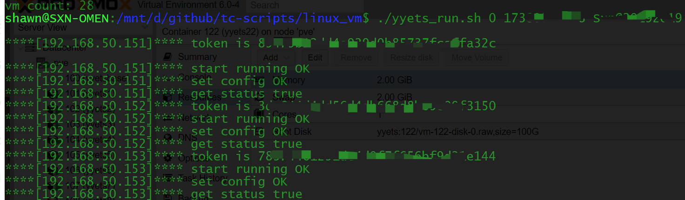

- ip_list.txt文件中填写所有ip地址，一行一个。
- ip地址前添加#号，表示该ip地址忽略
- 将两个文件放到可以和虚拟机互通的centos机器上。
- `./yyets_run.sh 0 手机号 密码`执行脚本。

运行截图：

**token is**: 内部值。
**start running OK**: 表示启动成功。
**set config OK**: 表示修改配置成功。
**get status true**: true表示运行状态正确，false表示运行状态不正确。